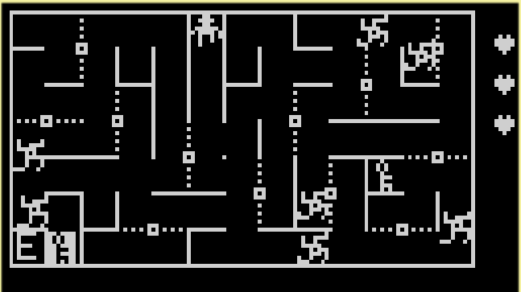

A small maze game for the Arduboy (Arduino Mobile Game Device).

### Status

Unfinished. It only has one level and needs lots of bells and whisltes, but its playable.

### How To Play

You must navigate your hero to the exit (big white circle). Avoid the monsters along the way.

There are turnstyle rotating doors that you can rotate by pushing against them. These doors also block the spiders path.

### Screenshot

